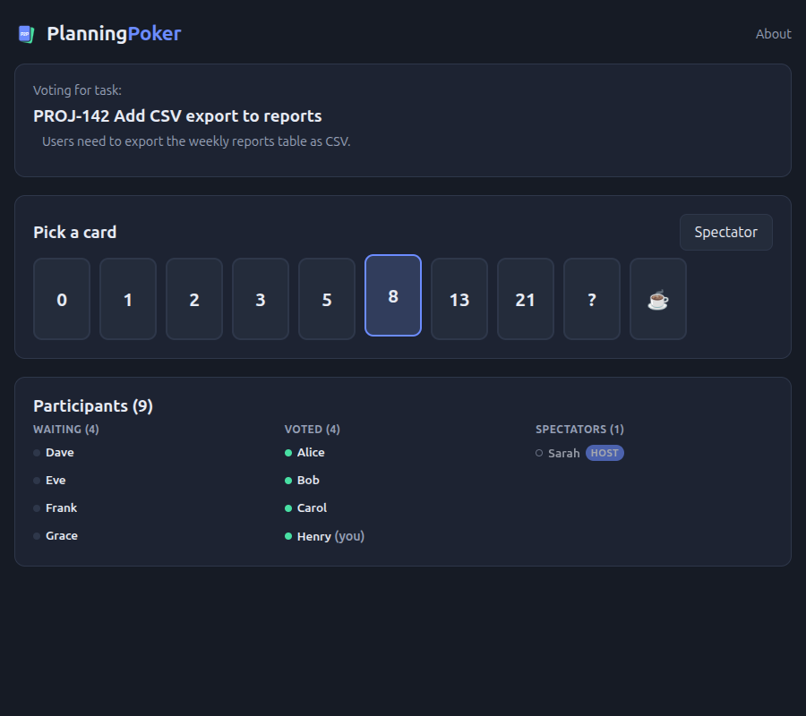

# Planning Poker

Anonymous, link-only planning poker. No accounts — create a room, share the
link (or QR code), and start estimating. The server holds each room's state
(who's in it, votes, tasks) in memory for as long as the room is active;
nothing is written to disk, and a room is discarded the moment everyone
leaves.

## Screenshots

An 8-person estimation session, end to end:

**Voting in progress** — everyone sees the current task, picks a card, and watches who's still deciding:



**Results, revealed** — the average is front and center, with the lowest,
highest, and majority vote each tagged with who cast it:


**Session summary** — a plain-text recap of every task once the session ends, ready to copy or save:


**Host view** — invite QR code, round controls, task management (add, edit, reorder), and live results, all in one place:


## Features

- **Link-only rooms** — create a room, share the link (and QR code, with a
  one-click zoom for projecting on a screen); only people with the link can
  join.
- **Fibonacci deck by default**, plus Modified Fibonacci, T-shirt sizes,
  powers of two, or a custom deck. Your display name and deck preference are
  remembered locally in this browser.
- **Multiple tasks** — the host/admin can queue up tasks with a title and
  (linkified) description, edit them, reorder them, and advance through the
  list. Regular participants only see the task currently being voted on.
- **Roles** — the room creator starts as host and can promote others to
  admin (co-host powers: reveal, reset, manage tasks/deck) or transfer
  ownership outright.
- **Spectator mode** — step back from estimating without leaving; spectators
  are excluded from voting and from the "everyone voted" check.
- **Auto-reveal** — on by default, reveals automatically 2s after every
  active participant has voted.
- **Resilient reconnects** — a page reload resumes your seat instantly, no
  re-joining prompt, no duplicate participant. A dropped connection is held
  open for a few seconds before the participant is removed, so a refresh
  never looks like someone left.
- **Results built for a glance** — the average front and center, and the
  lowest/highest/majority vote(s) tagged with who cast them, sorted by the
  deck's own scale rather than by vote count.
- **Session summary** — a plain-text recap of every task, its votes, and its
  average, ready to copy or save as a `.txt` file.

## Architecture

An npm-workspaces monorepo:

```
shared/   Data model, the room-state reducer, and the WebSocket protocol
server/   Node + Express + ws — the authoritative room server
client/   React + Vite + TypeScript — the UI
```

The server holds each room's `RoomState` in memory and is the sole source of
truth — every action a client sends (a vote, a reveal, a task edit) is
applied server-side and the resulting state is broadcast to everyone in the
room over one WebSocket connection per participant. There is no
peer-to-peer layer.

Because state lives in one process's memory, the app requires exactly one
running server instance — see `fly.toml` / `.github/workflows/deploy.yml`.

## Getting started

Requires Node.js 20+.

```bash
npm install
npm run dev
```

This starts the server on `:3001` and the Vite dev server on `:5173` (which
proxies `/ws` to the server). Open `http://localhost:5173`.

Other useful scripts:

```bash
npm run typecheck   # type-check all workspaces
npm test              # run the test suite (shared, server, client)
npm run build          # build the client for production (client/dist)
npm start                # run the production server (serves client/dist + WebSocket)
```

## License

MIT — see [LICENSE](./LICENSE).
