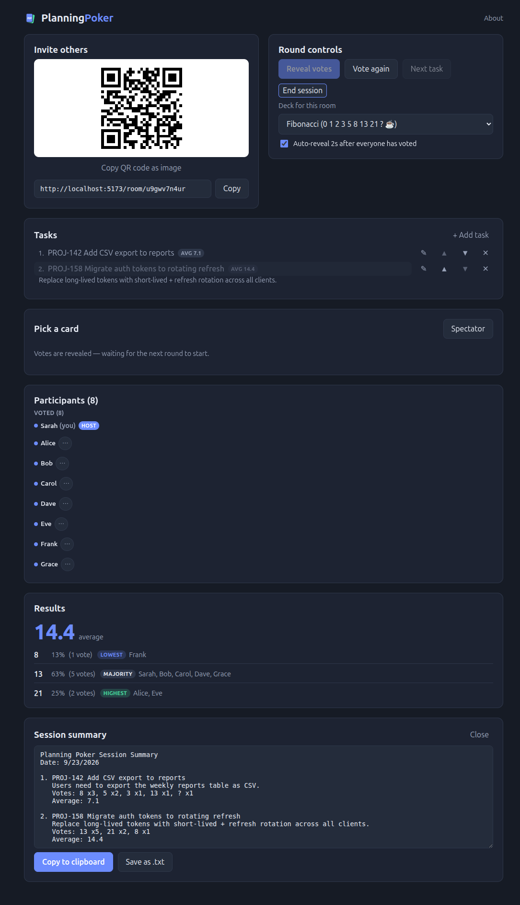

# Ending a session

Since a room and its data disappear the moment everyone leaves, grab a
summary before you close the tab if you want a record of what was
estimated.

A host or admin selects **End session** in [round controls](./roles.md#round-controls)
to open the summary panel:

The summary lists every task in the queue, its description, the vote
distribution, and its average — a plain-text recap you can:

- **Copy to clipboard**, to paste into a ticket, chat message, or doc.
- **Save as .txt**, downloaded as `planning-poker-<room-id>.txt`.

The summary only lists vote *values* and how many people picked each one —
not who voted what — so it stays a clean, shareable recap even if you paste
it somewhere outside the room.

Opening the summary doesn't end anything for other participants — the room
keeps running until everyone actually leaves, so you can check it mid-session
too, at any point after at least one task has been revealed.
