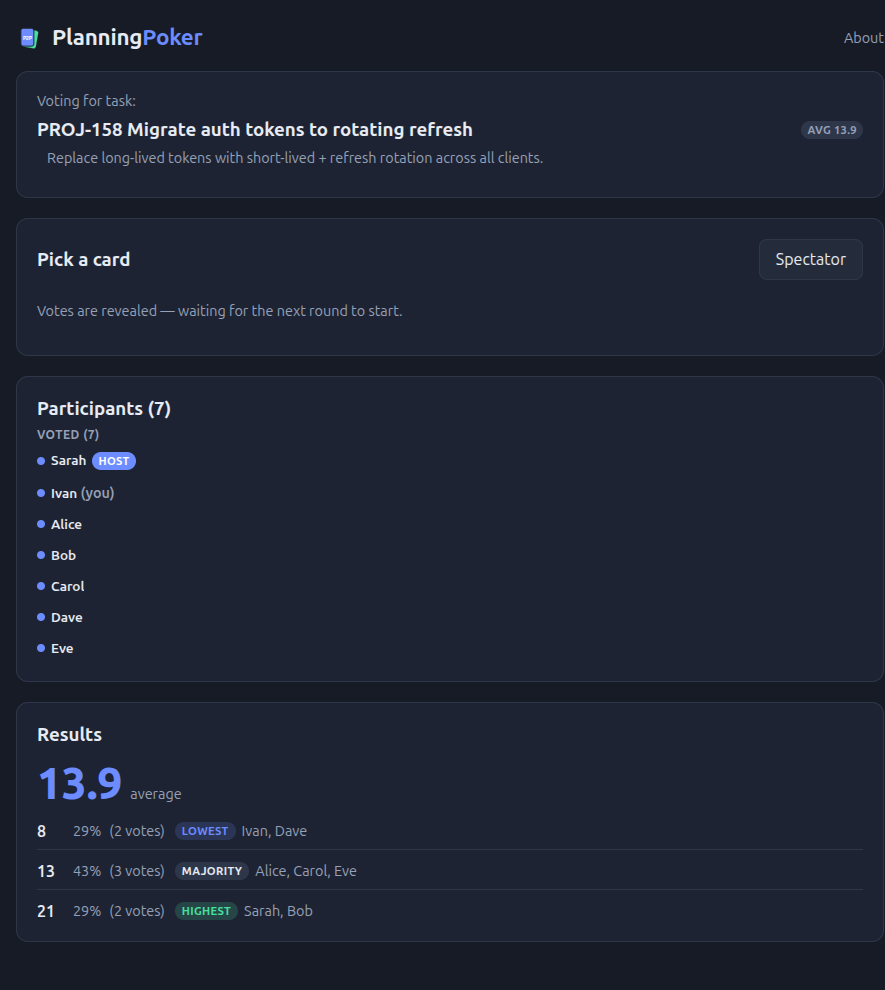

# Reading the results

Once a round is revealed, the **Results** panel shows the vote breakdown for
the current task:

- **Average**, front and center — the mean of every numeric vote cast (cards
  like `?` or `☕`, or non-numeric decks like T-shirt sizes, aren't counted
  toward it).
- **Distribution** — each distinct value that was voted, with the number and
  percentage of participants who picked it, sorted by the deck's own scale
  (so, for example, T-shirt sizes read S → M → L, not alphabetically or by
  vote count).
- **Who voted what** — the lowest, highest, and majority vote(s) are tagged
  with the names of the people who cast them, so it's easy to spot who to
  ask "why so high?" or "why so low?" in the follow-up discussion.

If nobody voted before the round was revealed, the panel just says so.

## Moving on

A host or admin can then:

- **Vote again** — re-run the same task from a clean slate.
- **Next task** — clear votes and move to the next item in the [task
  queue](./tasks.md).

Every task's result is kept for the rest of the session, so you can look
back at earlier estimates — and they all show up together in the
[end-of-session summary](./ending-a-session.md).
