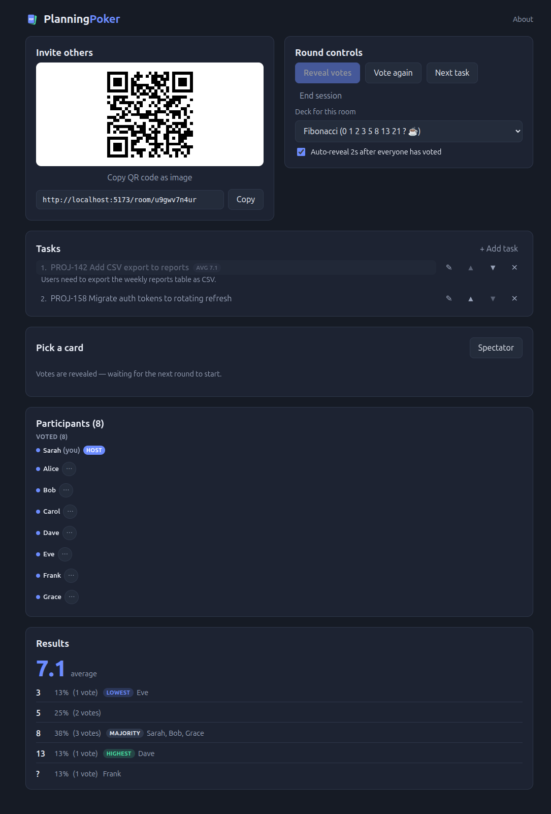

# Roles & host controls

There are three roles in a room:

| Role | Who | Can do |
|---|---|---|
| **Host** | The room's creator, or whoever it's been transferred to | Everything below, plus promote/demote admins, transfer ownership, and remove people |
| **Admin** | Anyone the host promotes | Reveal, vote again, next task, manage tasks, change the deck, toggle auto-reveal |
| **Member** | Everyone else | Vote, spectate, rename themselves |

Exactly one participant holds the host role at a time.

## Round controls

Hosts and admins get a **Round controls** card:

- **Reveal votes** — reveal the current round immediately, even if not
  everyone's voted yet.
- **Vote again** — clear votes for the current task and start over.
- **Next task** — clear votes and move to the next item in the [task
  queue](./tasks.md).
- **End session** — open the [session summary](./ending-a-session.md).
- **Deck for this room** — change what cards are on offer (see [Choosing a
  deck](./decks.md)); takes effect immediately for everyone.
- **Auto-reveal** checkbox — on by default; reveals automatically 2 seconds
  after every active (non-spectator) participant has voted.

## Managing participants

The participant list shows everyone in the room, grouped by whether they're
waiting, have voted, or are spectating. A host sees a **⋯** menu next to
everyone else's name with:

- **Make admin** / **Remove admin** — grant or revoke admin powers.
- **Transfer ownership** — hand the host role to someone else. You keep
  admin powers afterward, so you don't lose control entirely.
- **Remove from room** — see below.

### Removing someone

Selecting **Remove from room** (after confirming) disconnects that
participant immediately; they'll see a clear "you were removed" message
rather than a generic connection error, and won't be able to rejoin the
room by reopening the old link.

## If the host leaves

The host role doesn't automatically transfer if the host disconnects — it's
worth transferring ownership deliberately before you leave if you want
someone else to keep control of the room.
